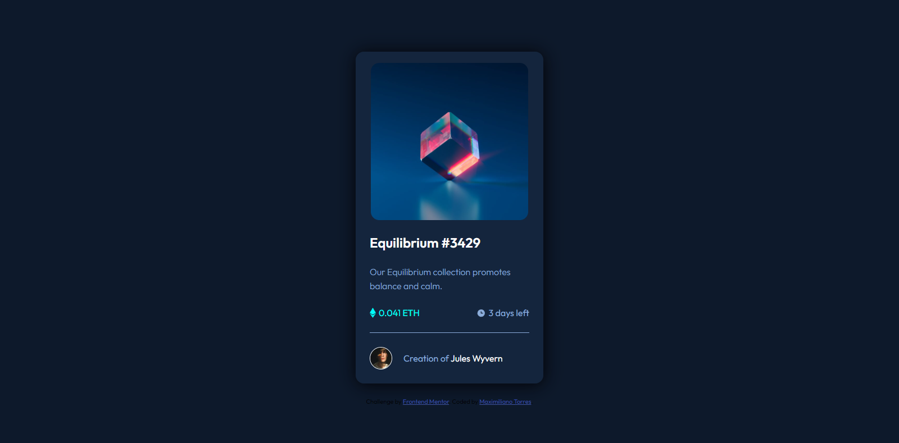

# Frontend Mentor - QR code component solution

This is a solution to the [QR code component challenge on Frontend Mentor](https://www.frontendmentor.io/challenges/qr-code-component-iux_sIO_H). Frontend Mentor challenges help you improve your coding skills by building realistic projects. 

## Table of contents

- [Overview](#overview)
  - [Screenshot](#screenshot)
  - [Links](#links)
- [My process](#my-process)
  - [Built with](#built-with)
  - [What I learned](#what-i-learned)
- [Author](#author)

**Note: Delete this note and update the table of contents based on what sections you keep.**

## Overview

### Screenshot

### Links

- Solution URL: https://gentle-a36b35.netlify.app/

## My process

### Built with

- Semantic HTML5 markup
- CSS custom properties
- Flexbox
- Mobile-first workflow

### What I learned
Another fairly simple challenge. Basically copy almost the same code that you made for the QR Code Component challenge, adapting it to the current challenge requirement. Many recommendations from the previous challenge were that I could summarize my html code if I didn't use a lot of wrapper tags, but I found that I couldn't get things to work the way I wanted if I did, and I feel more comfortable this way than wanting to. adding modifications I can make sure things line up right (or close to it) from the start. Something new that I was able to implement this time is to perform the hover effect on other html elements that are not just links or buttons, which turned out to be a bit complicated without using tutorials.

### Continued development

## Author

- Frontend Mentor -(https://www.frontendmentor.io/profile/MaxiTRR)
